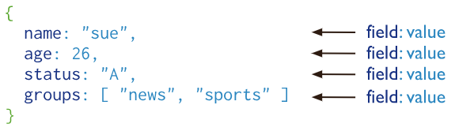

# Distributed MongoDB and Introduction to Cloud Computing

> This is a tutorial course covering MongoDB and introduction to cloud computing.

Tools used:

- JDK 11
- Maven
- JUnit 5, Mockito
- IntelliJ IDE
- MongoDB
- AWS

## Table of contents

1. [Introduction to MongoDB](https://github.com/backstreetbrogrammer/51_DistributedMongoDBAndCloudComputing?tab=readme-ov-file#chapter-01-introduction-to-mongodb)
2. [MongoDB installation for Windows](https://github.com/backstreetbrogrammer/51_DistributedMongoDBAndCloudComputing?tab=readme-ov-file#chapter-02-mongodb-installation-for-windows)
3. [MongoDB Replication](https://github.com/backstreetbrogrammer/51_DistributedMongoDBAndCloudComputing?tab=readme-ov-file#chapter-03-mongodb-replication)
4. [MongoDB Sharding](https://github.com/backstreetbrogrammer/51_DistributedMongoDBAndCloudComputing?tab=readme-ov-file#chapter-04-mongodb-sharding)
5. [Introduction to Cloud Computing](https://github.com/backstreetbrogrammer/51_DistributedMongoDBAndCloudComputing?tab=readme-ov-file#chapter-05-introduction-to-cloud-computing)

---

## Chapter 01. Introduction to MongoDB

MongoDB is a **document database** designed for ease of application development and scaling.

**_Document Database_**

A **record** in MongoDB is a **document**, which is a data structure composed of **field** and **value** pairs.

MongoDB documents are similar to JSON objects.

The values of fields may include other documents, arrays, and arrays of documents.



The advantages of using documents are:

- Documents correspond to native data types in many programming languages
- Embedded documents and arrays reduce the need for expensive joins
- Dynamic schema supports fluent polymorphism

MongoDB stores documents in **collections**.

**Collections** are analogous to **tables** in relational databases.

MongoDB stores data records as **BSON** documents.

BSON is a binary representation of JSON documents, though it contains more data types than JSON.

Each document object is assigned a unique immutable id field: `_id`, which uniquely identifies the object. For example,

```
_id: ObjectId("5099803df3f4948bd2f98391"),
```

**_SQL DB vs MongoDB Terminology_**


**Primary Key** can be marked equivalent to **_id** field in MongoDB.

**_MongoDB CRUD Operations_**

- **Create**
    - `db.collection.insertOne(object)`
    - `db.collection.insertMany([object1, object2...])`


- **Read**
    - `db.collection.find(filter)`
    - `db.collection.findOne(filter)`


- **Update**
    - `db.collection.updateOne(filter, update action)`
    - `db.collection.updateMany(filter, update action)`
    - `db.collection.replaceOne(filter, replacement)`


- **Delete**
    - `db.collection.deleteOne(filter)`
    - `db.collection.deleteMany(filter)`


The document's `_id` field is immutable and can **NOT** be changed after the document's creation.

There are many operations for querying, aggregation and bulk operations available.

---

## Chapter 02. MongoDB installation for Windows

MongoDB has the similar distributed systems concept of having a database server (`mongod`) and client (`mongo`).

**Steps to Download MongoDB:**

- Navigate to [MongoDB downloads](https://www.mongodb.com/try/download/community)
- Download the Community Server msi file
- Double-click the msi file to start the installation

**Install MongoDB:**

- Chose the `Custom Setup`
- Install `MongoD` as a Service:


- Copy the `bin` directory path to system `Path`

**Verify installation:**

- Search for `Services`
- MongoDB server should be running:


**Install Mongo Shell**

- Navigate to download [link](https://www.mongodb.com/try/download/shell)
- Download the latest msi file and install
- Copy the `bin` directory path to system `Path`

Launch Mongo Shell by executing `mongosh.exe` from command prompt

Some sample commands to run on shell:

- show all the databases: `show dbs`
- create a new database (say, **"shop"**) and use it at the same time: `use shop`
- create a new collection (say, **"products"**) and use it (insert records):
  `db.products.insertOne({name: "Guitar", price: 100.99})`
- show all the collections: `show collections`
- find all the documents in the collection: `db.products.find()`
- update a document: `db.products.updateOne({name: "Guitar"}, {$set: {price: 156.2}})`
- count all the documents: `db.products.countDocuments({})`
- delete all the documents: `db.products.deleteMany({})`
- exit the shell: `quit()`

MongoDB config file located in `/bin` folder: `mongod.cfg`

**Playground**

We can start `mongod` on different port than default `27017`:

```
# mongo server
mongod --port 27018

# mongo client
mongo --port 27018
```  

---

## Chapter 03. MongoDB Replication

A replica set in MongoDB is a group of `mongod` processes that maintain the **_same_** data set.

Replica sets provide **redundancy** and **high availability**, and are the basis for all production deployments.

With multiple copies of data on different database servers, replication provides a level of **fault tolerance** against
the loss of a single database server.

A replica set contains several **_data bearing_** nodes and optionally one **_arbiter_** node.

Of the **data bearing** nodes, one and only one member is deemed the **_primary_** node, while the other nodes are
deemed **_secondary_** nodes.


The **_primary_** node receives all **_write_** operations.

A replica set can have **only one primary** capable of confirming writes with `{ w: "majority" }` **write concern**.

The **primary** records all changes to its data sets in its operation log, i.e. `oplog`.

The **secondaries** replicate the primary's `oplog` and apply the operations to their data sets such that the
**secondaries'** data sets reflect the **primary's** data set.

If the **primary** is unavailable, an eligible **secondary** will hold an **_election_** to elect itself the new *
*primary**.

In some circumstances, such as we have a **primary** and a **secondary** but cost constraints prohibit adding another
**secondary**, we may choose to add a `mongod` instance to a replica set as an `arbiter`.


An **_arbiter_** **participates** in elections but does **not** hold data (i.e. does not provide data redundancy).

An **arbiter** will always be an **arbiter** whereas a **primary** may step down and become a **secondary** and a
**secondary** may become the **primary** during an election.

**_Launching a Replication Set_**

Let's create three new directories in our local system.

```
cd <local path>
mkdir rs0-0 rs0-1 rs0-2
```

Now, we will launch our **first** `mongodb` replica instance.

```
mongod --replSet rs0 --port 27017 --bind_ip 127.0.0.1 --dbpath "<local path>\rs0-0" --oplogSize 128
```

We will launch other two `mongod` replica instances belonging to the same replica set `rs0`.

```
mongod --replSet rs0 --port 27018 --bind_ip 127.0.0.1 --dbpath "<local path>\rs0-1" --oplogSize 128
```

```
mongod --replSet rs0 --port 27019 --bind_ip 127.0.0.1 --dbpath "<local path>\rs0-2" --oplogSize 128
```

Next step is to connect to one of the `mongod` instances via mongo client: `mongo --port 27017`

Initialize our replica set by running this command:

```
rs.initiate({
  _id: "rs0",
  members: [
    {
      _id: 0,
      host: "127.0.0.1:27017"
    },
    {
      _id: 1,
      host: "127.0.0.1:27018"
    },
    {
      _id: 2,
      host: "127.0.0.1:27019"
    }
  ]
})
```

If we `quit()` and again connect: `mongo --port 27017`, we may see that our first node `rs0-0` is already elected as
**PRIMARY**.

Similarly, connection to ports `27018` and `27019` will show as **SECONDARY** nodes.

**_Simple Java App for Guidemy Online courses_**

- Application can enroll new students
- Each course will be stored in a separate `mongodb` **collection**
- Application will validate if:
    - if a new student is already enrolled
    - if the student has passed entrance test exams with minimum cutoff marks

We need to add `mongdb` driver dependency in `pom.xml`.

```
        <dependency>
            <groupId>org.mongodb</groupId>
            <artifactId>mongodb-driver</artifactId>
            <version>3.12.14</version>
        </dependency>
```

Class `GuidemyOnline`:

```java
import com.mongodb.MongoClient;
import com.mongodb.MongoClientURI;
import com.mongodb.ReadPreference;
import com.mongodb.WriteConcern;
import com.mongodb.client.MongoCollection;
import com.mongodb.client.MongoDatabase;
import org.bson.Document;

import static com.mongodb.client.model.Filters.eq;

public class GuidemyOnline {

    private static final String MONGO_DB_URL
            = "mongodb://127.0.0.1:27017,127.0.0.1:27018,127.0.0.1:27019/?replicaSet=rs0";
    private static final String DB_NAME = "guidemy-online";
    private static final double MIN_PASSING_MARKS_PERCENTAGE = 90.0D;

    public static void main(final String[] args) {
        final String courseName = args[0];
        final String studentName = args[1];
        final int age = Integer.parseInt(args[2]);
        final double testMarksPercentage = Double.parseDouble(args[3]);

        final MongoDatabase guidemyOnlineDb = connectToMongoDB(MONGO_DB_URL, DB_NAME);
        enroll(guidemyOnlineDb, courseName, studentName, age, testMarksPercentage);
    }

    private static void enroll(final MongoDatabase database, final String courseName, final String studentName,
                               final int age, final double testMarksPercentage) {
        if (!isValidCourse(database, courseName)) {
            System.err.printf("Invalid course: %s%n", courseName);
            return;
        }

        final MongoCollection<Document> courseCollection
                = database.getCollection(courseName)
                          .withWriteConcern(WriteConcern.MAJORITY)
                          .withReadPreference(ReadPreference.primaryPreferred());

        if (courseCollection.find(eq("name", studentName)).first() != null) {
            System.out.printf("Student %s has already enrolled%n", studentName);
            return;
        }

        if (testMarksPercentage < MIN_PASSING_MARKS_PERCENTAGE) {
            System.out.printf("Please give the entrance test again and get more than cutoff: [%.1f] %n",
                              MIN_PASSING_MARKS_PERCENTAGE);
            return;
        }

        courseCollection.insertOne(new Document("name", studentName)
                                           .append("age", age)
                                           .append("testMarksPercentage", testMarksPercentage));
        System.out.printf("Student [%s] was successfully enrolled in course [%s]%n", studentName, courseName);

        for (final Document document : courseCollection.find()) {
            System.out.println(document);
        }
    }

    private static boolean isValidCourse(final MongoDatabase database, final String courseName) {
        boolean isCollectionFound = false;
        for (final String collectionName : database.listCollectionNames()) {
            if (collectionName.equals(courseName)) {
                isCollectionFound = true;
                break;
            }
        }
        return isCollectionFound;
    }

    public static MongoDatabase connectToMongoDB(final String url, final String dbName) {
        final MongoClient mongoClient = new MongoClient(new MongoClientURI(url));
        return mongoClient.getDatabase(dbName);
    }

}

```

Create the packaged jar: `mvn clean package`

**_Demo Run_**

a) Running the program with arguments: `Python John 25 91.5`

- Output: `Invalid course: Python`

b) Let's connect to our MongoDB primary node and then add Python course: `mongo --port 27017`

```
$ mongo --port 27017

# create new collection
rs0:PRIMARY> use guidemy-online

# add Python course
rs0:PRIMARY> db.createCollection("Python")

# verify
rs0:PRIMARY> show collections
Python
```

c) Let's rerun the program with the same arguments: `Python John 25 91.5`

- Output:

```
Student [John] was successfully enrolled in course [Python]
Document{{_id=65e8ec252853ca1558e652e7, name=John, age=25, testMarksPercentage=91.5}}
```

d) Rerun the program with the same arguments: `Python John 25 91.5`

- Output: `Student John has already enrolled`

e) Running the program with arguments: `Python Rahul 31 88.3`

- Output: `Please give the entrance test again and get more than cutoff: [90.0] `

f) Let's rerun the program with the improved entrance test marks arguments: `Python Rahul 31 94.0`

- Output:

```
Student [Rahul] was successfully enrolled in course [Python]
Document{{_id=65e8ec252853ca1558e652e7, name=John, age=25, testMarksPercentage=91.5}}
Document{{_id=65e8ed5e5c5cd95f9276c850, name=Rahul, age=31, testMarksPercentage=94.0}}
```

g) Let's shut down the mongoDB primary node and add a new student to the course: `Python Anna 21 97.5`

- Output:

```
Student [Anna] was successfully enrolled in course [Python]
Document{{_id=65e8ec252853ca1558e652e7, name=John, age=25, testMarksPercentage=91.5}}
Document{{_id=65e8ed5e5c5cd95f9276c850, name=Rahul, age=31, testMarksPercentage=94.0}}
Document{{_id=65e8eea0494d1b36b560742e, name=Anna, age=21, testMarksPercentage=97.5}}
```

Thus, we observed that even if the primary node was down, one of the two secondary nodes became primary.

Data was replicated correctly, providing fault tolerance.

---

## Chapter 04. MongoDB Sharding

Sharding allows us to scale your database to handle increased loads to a nearly unlimited degree.

It does this by increasing **read/write throughput**, and storage **capacity**.

In MongoDB, a sharded cluster consists of:

- Shards
- Mongos
- Config servers

A **shard** is a **_replica set_** that contains a subset of the cluster's data.

The `mongos` acts as a query **router** for client applications, handling both read and write operations.

It dispatches client requests to the relevant shards and aggregates the result from shards into a consistent client
response.

Clients connect to a `mongos`, not to individual shards.

**Config servers** are the authoritative source of sharding **metadata**.

The sharding metadata reflects the state and organization of the sharded data.

The metadata contains the list of sharded collections, routing information, etc.

In its simplest configuration (a single shard), a sharded cluster will look like this:


**_Sharding strategy_**

MongoDB supports two sharding strategies for distributing data across sharded clusters:

- Ranged Sharding
- Hashed Sharding

**Ranged sharding** divides data into **_ranges_** based on the shard key values.

Each chunk is then assigned a range based on the shard key values.


A range of shard keys whose values are **“close”** are more likely to reside on the same chunk.

This allows for targeted operations as a `mongos` can route the operations to only the shards that contain the required
data.

**Hashed Sharding** involves computing a **_hash_** of the shard key field’s value.

Each chunk is then assigned a range based on the hashed shard key values.


While a range of shard keys may be **“close”**, their hashed values are unlikely to be on the same chunk.

Data distribution based on hashed values facilitates more even data distribution, especially in data sets where the
shard key changes monotonically.

However, hashed sharding does not provide efficient range-based operations.

**_Sharding demo in local_**

- Create three folders in local:

```
cd <local-folder>
mkdir config-srv-0 config-srv-1 config-srv-2
```

- Run the local `mongod` config servers:

```
$ mongod --configsvr --replSet config-rs --dbpath "<local path>\config-srv-0" --bind_ip 127.0.0.1 --port 27020 
```

```
$ mongod --configsvr --replSet config-rs --dbpath "<local path>\config-srv-1" --bind_ip 127.0.0.1 --port 27021 
```

```
$ mongod --configsvr --replSet config-rs --dbpath "<local path>\config-srv-2" --bind_ip 127.0.0.1 --port 27022 
```

- Connect to `mongod` config server

```
$ mongo --port 27020
```

Initialize our config servers by running this command:

```
rs.initiate({
  _id: "config-rs",
  members: [
    {
      _id: 0,
      host: "127.0.0.1:27020"
    },
    {
      _id: 1,
      host: "127.0.0.1:27021"
    },
    {
      _id: 2,
      host: "127.0.0.1:27022"
    }
  ]
})
```

- Let's create our two shards:

```
cd <local-folder>
mkdir shard-0 shard-1
```

- Run these two shards:

```
$ mongod --shardsvr --port 27017 --bind_ip 127.0.0.1 --dbpath "<local path>\shard-0" --oplogSize 128
```

```
$ mongod --shardsvr --port 27018 --bind_ip 127.0.0.1 --dbpath "<local path>\shard-1" --oplogSize 128
```

- Lastly, let's run our `mongos` router:

```
$ mongos --configdb config-rs/127.0.0.1:27020,127.0.0.1:27021,127.0.0.1:27022 --bind_ip 127.0.0.1 --port 27023
```

- Let's add our shard details to `mongos`:

```
$ mongo --port 27023
```

```
mongos> sh.addShard("127.0.0.1:27017")
```

```
mongos> sh.addShard("127.0.0.1:27018")
```

- Change the chunk size:

```
mongos> use config
mongos> db.settings.save( { _id:"chunksize", value: 1 } )
```

**Video DB Demo app**

- Let's create our new database:

```
mongos> use videodb

mongos> sh.enableSharding("videodb")
```

- Insert some sample movies:

```
mongos> db.movies.insertOne({ "name": "Pulp Fiction", "directors": ["Quentin Tarantino"], "year": 1994, "cast": ["Amanda Plummer", "Samuel L. Jackson", "Bruce Willis", "John Travolta", "Uma Thurman"], "rating": 10.0 })
mongos> db.movies.insertOne({ "name": "Moana", "directors": ["Ron Clements", "John Musker"], "year": 2016, "cast": ["Aulii Wayne Johnson", "Temuera Morrison", "Rachael House", "Alan Tudyk", "Rachael House"], "rating": 9.9 })
```

We can shard the `movies` collection:

- based on `name` field, OR,
- using the **range-based** strategy.

Let's create an index first on `name` field:

```
mongos> db.movies.createIndex( { name: 1 } )

# shard the collection
mongos> sh.shardCollection("videodb.movies", { name : 1 } )

# check the status
mongos> sh.status()
```

Now, we can try the **hash-based** sharding.

- We can create a new collection: `users`

```
mongos> use videodb

# insert 2 documents
mongos> db.users.insertOne({ "user_name": "Michael Pogrey", "watched_movies": ["Moana", "Start Wars"], "favorite_genres": ["anime", "action"] })
mongos> db.users.insertOne({ "user_name": "Mary Gardener", "watched_movies": ["Dracula", "Spider Man"], "favorite_genres": ["horror", "cartoon", "action"] })

# create hash-based index
mongos> db.users.createIndex( { _id: "hashed" } )
```

- We can shard the collection

```
mongos> sh.shardCollection("videodb.users", { _id: "hashed" } )

# check the status
mongos> sh.status(true)
```

---

## Chapter 05. Introduction to Cloud Computing


